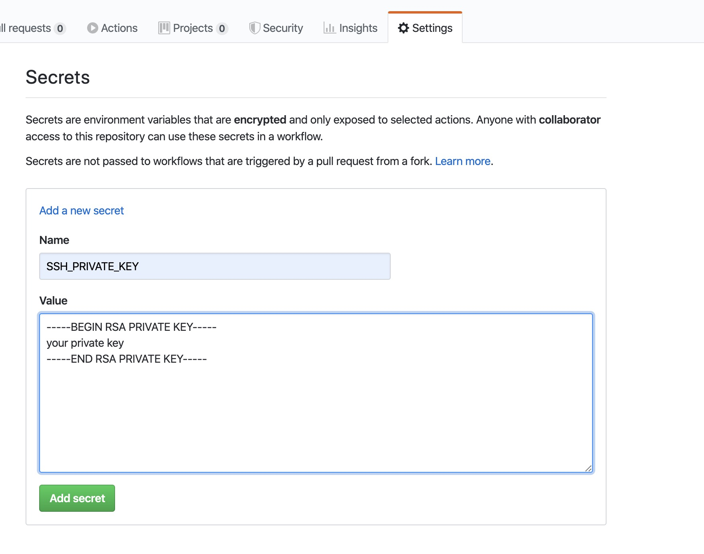
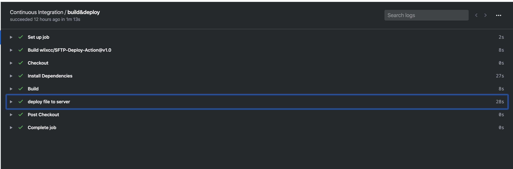
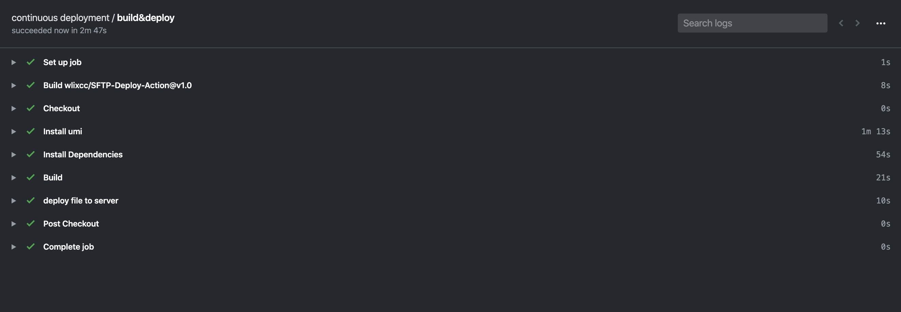

# SFTP Deploy action

Use this action to deploy your files to an SSH server using password authentication.

Based on SFTP-Deploy-Action https://github.com/wlixcc/SFTP-Deploy-Action

## Inputs

### `username`

**Required** SSH username.

### `server`

**Required** SSH server address.

### `port`

SSH server port , default `22`

### `ssh_password`

 **Required** SSH password

### `local_path`

 **Required** `local_path` of your project, if you want transfer a single file:use a path like `./myfile`, if you want transfer a directory: use a path like `./static/*`, it will transfer all files under the `static` directory. Defaults to `./*`(will transfer all files in your repo).

### `remote_path`
 **Required** remote_path

### `args`
args of sftp cmd, E.g.`-o ConnectTimeout=5`

## Action Example

	on: [push]

	jobs:
	  deploy_job:
	    runs-on: ubuntu-latest
	    name: deploy
	    steps:
	      - name: Checkout
	        uses: actions/checkout@v2
	      - name: deploy file
	        uses: wlixcc/SFTP-Deploy-Action@v1.0
	        with:
	          username: 'root'
	          server: 'your server ip'
	          ssh_private_key: ${{ secrets.SSH_PRIVATE_KEY }}
	          local_path: './static/*'
	          remote_path: '/var/www/app'
	          args: '-o ConnectTimeout=5'

## 1. [Deploy React App Example](https://github.com/wlixcc/React-Deploy)

> If you use nginx, all you need to do is upload the static files to the server after the project is built

	on: [push]

	jobs:
	  deploy_job:
	    runs-on: ubuntu-latest
	    name: build&deploy
	    steps:
	      # To use this repository's private action, you must check out the repository
	      - name: Checkout
	        uses: actions/checkout@v2

	      - name: Install Dependencies
	        run: yarn
	      - name: Build
	        run: yarn build

	      - name: deploy file to server
	        uses: wlixcc/SFTP-Deploy-Action@v1.0
	        with:
	          username: 'root'
	          server: '${{ secrets.SERVER_IP }}'
	          ssh_private_key: ${{ secrets.SSH_PRIVATE_KEY }}
	          local_path: './build/*'
	          remote_path: '/var/www/react-app'
	          args: '-o ConnectTimeout=5'

 

## 2.Deploy Umi App Example (Ant Design Pro)

	name: continuous deployment
	on: [push]

	jobs:
	  deploy_job:
	    runs-on: ubuntu-latest
	    name: build&deploy
	    steps:
	      # To use this repository's private action, you must check out the repository
	      - name: Checkout
	        uses: actions/checkout@v2

	      - name: Install umi
	        run: yarn global add umi

	      - name: Install Dependencies
	        run: yarn
	      - name: Build
	        run: yarn build

	      - name: deploy file to server
	        uses: wlixcc/SFTP-Deploy-Action@v1.0
	        with:
	          username: 'root'
	          server: '${{ secrets.SERVER_IP }}'
	          ssh_private_key: ${{ secrets.SSH_PRIVATE_KEY }}
	          local_path: './dist/*'
	          remote_path: '/var/www/umiapp'
	          args: '-o ConnectTimeout=5'
 

