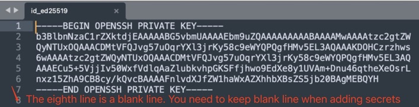

# SFTP Deploy Action

> Use this action to deploy your files to a server using `SSH Private Key`

> 使用此 `action` 部署你的项目到服务器上，中文介绍链接：[使用Github Action 部署项目到云服务器](https://zhuanlan.zhihu.com/p/107545396)

---

## 🚀 **1. Inputs**

| Name                   | Required | Default | Description                                                                                                          |
|------------------------|----------|---------|----------------------------------------------------------------------------------------------------------------------|
| `username`             | yes      |         | SSH username                                                                                                         |
| `server`               | yes      |         | Remote host                                                                                                          |
| `port`                 | yes      | 22      | Remote host port                                                                                                     |
| `ssh_private_key`      | no       |         | You can copy the private key from your `ssh_private_key` file and save it to `repo/settings/secrets`<br>  |
| `local_path`           | yes      | `./*`   | Local path of your project. <br> - Single file: `./myfile`  <br> - Directory: `./static/*`  <br>  Default: `./*` (will put all files in your repo). |
| `remote_path`          | yes      |         | The target folder on the remote server.                                                                              |
| `sftp_only`            | no       |         | If your port only accepts the sftp protocol, set this option to `true`. However, when set to `true`, the remote folder won't be automatically created. |
| `sftpArgs`            | no       |         | Extra arguments you want to pass to `sftp`, for example: `-o ConnectTimeout=5`                                       |
| `delete_remote_files`  | no       | false   | Set to `true` to delete the remote path folder and all files in it **before** uploading.                             |
| `password`             | no       |         | SSH password. If a password is set, `ssh_private_key` and `ssh_passphrase` is ignored. *(for @v1.2.4 and greater)*                        |
| `rsyncArgs`            | no       |         | Additional arguments for the `rsync` command. You can customize file synchronization behavior, such as excluding files or directories. Example: `--exclude=node_modules --exclude=.git --exclude=*.log`. *(for @v1.2.5 and greater)* |
| `ssh_passphrase`           | no       |         | The passphrase for encrypted ssh private-key |

> ⚠️ **Warning:**  
> Be careful when using `delete_remote_files`. This will **permanently delete** the remote path folder and all files in it **before** uploading.

---

## 📦 **2. Action Examples**

### **🔹 Basic Example**

```yaml
on: [push]

jobs:
  deploy_job:
    runs-on: ubuntu-latest
    name: Deploy Files
    steps:
      - name: Checkout
        uses: actions/checkout@v2

      - name: Deploy to Server
        uses: wlixcc/SFTP-Deploy-Action@v1.2.5
        with:
          username: 'root'
          server: 'your server ip'
          ssh_private_key: ${{ secrets.SSH_PRIVATE_KEY }}
          local_path: './static/*'
          remote_path: '/var/www/app'
          sftpArgs: '-o ConnectTimeout=5'
```

---

### **🔹 Example with rsyncArgs**

```yaml
on: [push]

jobs:
  deploy_job:
    runs-on: ubuntu-latest
    name: Deploy with rsync exclude
    steps:
      - name: Checkout
        uses: actions/checkout@v2

      - name: Deploy with Exclude Patterns
        uses: wlixcc/SFTP-Deploy-Action@v1.2.5
        with:
          username: 'root'
          server: 'your server ip'
          ssh_private_key: ${{ secrets.SSH_PRIVATE_KEY }}
          local_path: './'
          remote_path: '/var/www/app'
          rsyncArgs: '--exclude=node_modules --exclude=.git --exclude=*.log'
          sftpArgs: '-o ConnectTimeout=5'
```

---

### **🔹 Example with Password Authentication**

```yaml
on: [push]

jobs:
  deploy_job:
    runs-on: ubuntu-latest
    name: Deploy with Password
    steps:
      - name: Checkout
        uses: actions/checkout@v2

      - name: Deploy with Password
        uses: wlixcc/SFTP-Deploy-Action@v1.2.5
        with:
          username: ${{ secrets.FTP_USERNAME }}
          server: ${{ secrets.FTP_SERVER }}
          port: ${{ secrets.FTP_PORT }}
          local_path: './static/*'
          remote_path: '/var/www/app'
          sftp_only: true
          password: ${{ secrets.FTP_PASSWORD }}
```


### **🔹 Example with Encrypted Private Key Authentication**
```yaml
on: [push]

jobs:
  deploy_job:
    runs-on: ubuntu-latest
    name: Deploy with Password
    steps:
      - name: Checkout
        uses: actions/checkout@v2

      - name: Deploy with Password
        uses: wlixcc/SFTP-Deploy-Action@v1.2.5
        with:
          username: ${{ secrets.FTP_USERNAME }}
          server: ${{ secrets.FTP_SERVER }}
          port: ${{ secrets.FTP_PORT }}
          local_path: './static/*'
          remote_path: '/var/www/app'
          sftp_only: true
          ssh_private_key:  ${{ secrets.SSH_PRIVATE_KEY }}
          ssh_passphrase: ${{ secrets.SSH_PASSPHRASE }}
```
---

## 🌐 **3. [Deploy React App Example](https://github.com/wlixcc/React-Deploy)**

```yaml
on: [push]

jobs:
  deploy_job:
    runs-on: ubuntu-latest
    name: Build & Deploy React App
    steps:
      - name: Checkout
        uses: actions/checkout@v2

      - name: Install Dependencies
        run: yarn

      - name: Build
        run: yarn build

      - name: Deploy Build Folder
        uses: wlixcc/SFTP-Deploy-Action@v1.2.5
        with:
          username: 'root'
          server: '${{ secrets.SERVER_IP }}'
          ssh_private_key: ${{ secrets.SSH_PRIVATE_KEY }}
          local_path: './build/*'
          remote_path: '/var/www/react-app'
          rsyncArgs: '--exclude=*.map'
          sftpArgs: '-o ConnectTimeout=5'
```


---

## 🛡️ **4. Invalid format? You need to keep the format**

If you use the **Ed25519** algorithm to generate an SSH key pair:

```sh
ssh-keygen -t ed25519 -C "your_email@example.com"
```

⚠️ **Important:**  
The last line of the private key **must remain a blank line** when adding it to **Repository Secrets**.  
If you remove it, you might encounter an `invalid format` error.



---


